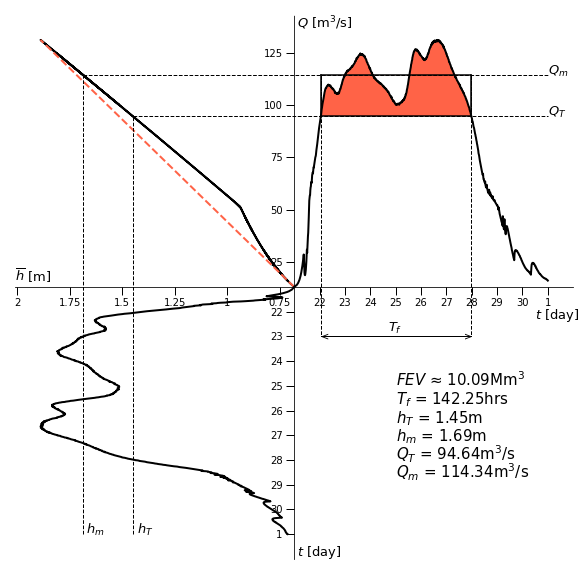
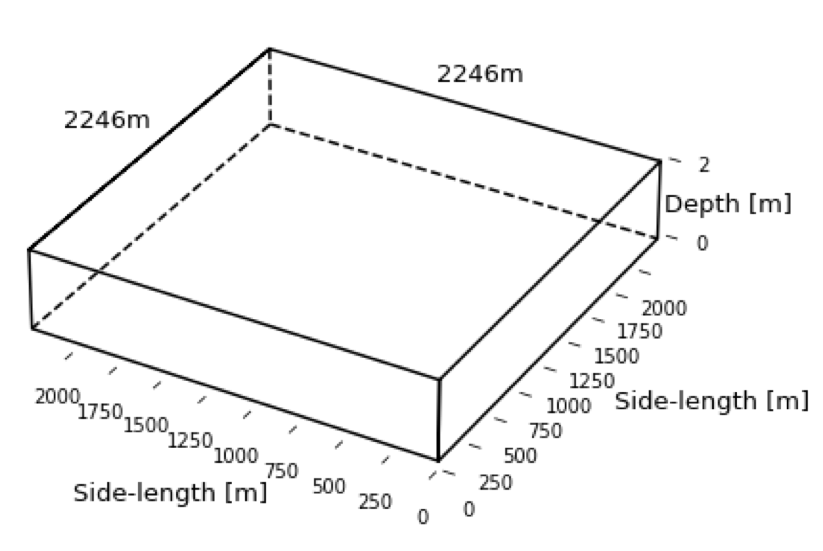
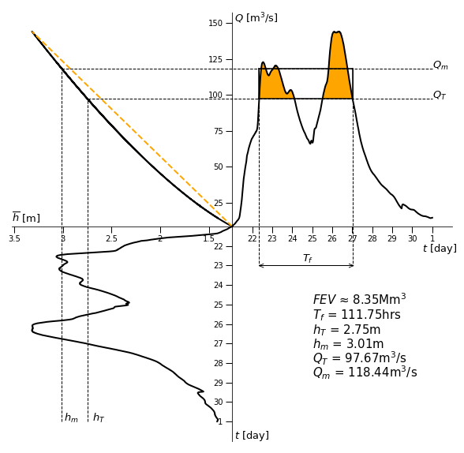
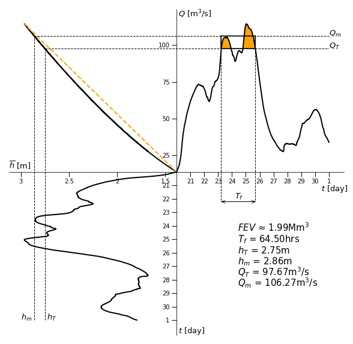
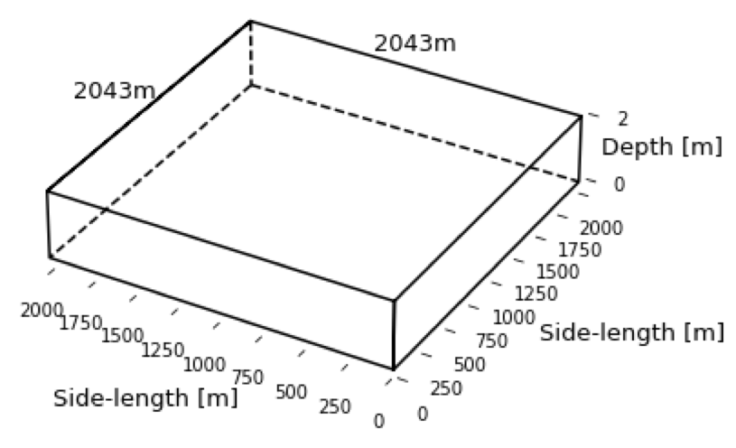

# The River Avon

## Stratford-upon-Avon

Stratford-upon-Avon was chosen as a town of interest, in regards to the investigation of flooding, due to the local knowledge of the author. A plaque erected on the banks of the River Avon in Stratford-upon-Avon, nearby to the Royal Shakespear Company's main building, displays the vast heights the river has reached in the past, thereby heavily implying a historical problem with flooding within the town.

*Plaque depicting historic flood heights in Stratford-upon-Avon - http://www.stratford-herald.com/83343-updated-river-avon-remains-on-flood-alert-as-water-levels-fall.html*

According to https://riverlevels.uk/river-avon-stratford-upon-avon-stratford, the most recent high recorded at the Stratford-upon-Avon gauging station was 1.89m on Monday the 26th of November 2012 and so it is this specific flood that will be investigated.

### Flooding Data

*Graph depicting the Avon's height during the months of November and December 2012, using data provided by the Environment Agency for the Cox's Yard guaging station located within Stratford-upon-Avon.*

The graph above clearly emphasizes two flooding events, one at the end of November (as expected from River Levels UK) but also another one at the end of December, most likely assisted by the ground already being waterlogged from the earlier November flood. To be thorough, it is now appropriate to find the FEV (as defined on the project homepage; https://github.com/Rivers-Project-2018/Group-Project) of each respective flooding event as opposed to simply hypothesising that because the November event has a higher maximum river height, a larger FEV is implied also. Both of the following graphs are plotted using the threshold height (the height at which the river began to flood) of 1.45 meters, as well as using the rating information for the Cox's Yard gauging station (providing the relationship between height and flow rate (Q)) where the rating information has been provided by the Environment Agency. This threshold height was chosen as although the Environment Agency did say the threshold height for when the river broke its banks was 1.2m, previous experience analysing the Rivers Don, Calder and Aire mean the Environment Agency tends to underestimate the threshold height. https://flood-warning-information.service.gov.uk/station/2046Evidence states that flooding of low lying land may occur at 1.2m whilst flooding of property may occur at just under 1.7m. Therefore, a good estimate of a threshold height would be the average of the two, i.e. 1.45m. A transcript of all email exchanges with the Environment Agency in regards to the analysis of the River Avon can be found in this repository under the name '---'.

*The November 2012 flooding event in Stratford-upon-Avon.*

*The December 2012 flooding event in Stratford-upon-Avon.*

Hence it can be verified that, indeed, the November event resulted in a larger FEV. The fact that the flooding event was prolonged over several days, whereas the majority of the other floods analyzed lasted less than a day, means the FEV is relatively large. 

### Square Lake

The FEV of the November event can be helpfully visualized by a 'square lake', a lake of depth 2m with equal side-lengths, which are, in this case, 3958m each. This square lake, therefore, represents the same volume of the FEV; 10.04Mm^3.

*Graph depicting the 'square lake' of depth 2m that holds the same volume of flood water as discharged during the flooding event of November 2012, Stratford-upon-Avon.*

It is important to note, especially in this case where the flood being analyzed produces a large FEV, that the FEV is highly dependent on the threshold height chosen. The graph below depicts how the FEV can be reduced, or indeed enlarged, drastically for higher, or lower, threshold heights, leading to a square lake with shorter sides.

*Graph displaying the relationship between different threshold heights and their respective FEV's.*

## Warwick

Having researched the November 2012 in Stratford-upon-Avon, it would now be of interest to investigate the same flood but further upstream the River Avon in order to to see if there are any differences or similarities, namely the city of Warwick.

 

*The famous Warwick castle, unflooded and during the November 2012 floods. The sources are https://www.flickr.com/photos/ell-r-brown/27107990951/in/photostream/ and https://www.coventrytelegraph.net/news/local-news/flood-alerts-still-place-warwickshire-10661416 respectively.*

### Flooding Data

The graph below shows that, as expected, the River Avon follows much the same behaviour in both Stratford-upon-Avon and Warwick. The smoothness of the graph below in comparison to the respective Stratford-upon-Avon graph is also not unexpected as the Environment Agency did attach a warning when sending the height data, that the gauging information from Stratford-upon-Avon is not as accurate as the gauging information from Warwick.

*Graph depicting the various river heights for the gauging station at Warwick for the months of November and December 2012.*

Performing much the same analysis as was performed on the Stratford-upon-Avon height data, it can be seen that, again, the FEV from the November 2012 flood is larger than that of the December 2012. The threshold height provided by the Environment Agency was 2.3m but, as stated above, this estimate tends to be low. As the threshold height used for Stratford-upon-Avon is 20% larger than the given threshold by the Environment Agency, a reasonable estimation for the threshold height would be to grow the provided threshold for Warwick by 20%  also. This reulsts in a threshold height of 2.75m. The fact that the Warwick FEV is smaller than the Stratford-upon-Avon FEV could be due to a number of factors, such as the possible inaccuracy of the height data for Stratford-upon-Avon. If the data for both locations is taken to be accurate then this difference could be explained by significant surface water, ground water and rain water flowing into the River Avon after it flows through Warwick but before it reaches Stratford. This could be indicative of the need for flood mitigation not only before Warwick but also in between Warwick and Stratford.

*The November 2012 flooding event in Warwick.*

*The December 2012 flooding event in Warwick.*

### Square Lake

The difference could also be explained by the choice of threshold height. For example, if the threshold height was chosen as 2.5m for the Warwick flooding event then, as can be seen from the FEV against hT graph for Warwick below, the FEV's will be more on par.

*Graph displaying the relationship between different threshold heights and their respective FEV's*

Simlarly to the Square lake for the Stratford-upon-Avon flood, the FEV for Warwick can be helpfully visualised by a square lake of depth 2m. The smaller side length of 2043m is reflective of the smaller FEV.

*Graph depicting the 'square lake' of depth 2m that holds the same volume of flood water as discharged during the flooding event of November 2012, Warwick.*
