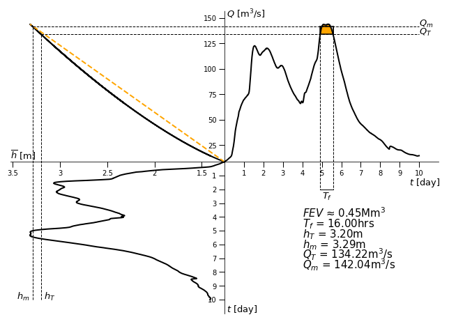
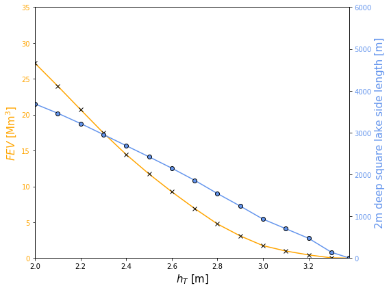

# The River Avon
## Stratford-upon-Avon
Stratford-upon-Avon was chosen as a town of interest, in regards to the investigation of flooding, due to the local knowledge of the author. A plaque erected next to the River Avon in Stratford-upon-Avon, nearby to the Royal Shakespear Company's main building, displays the vast heights the river has reached in the past, thereby heavily implying a historical problem with flooding within the town.

*Plaque depicting historic flood heights in Stratford-upon-Avon. The original source for this photo is http://www.stratford-herald.com/83343-updated-river-avon-remains-on-flood-alert-as-water-levels-fall.html*

## Warwick
 

