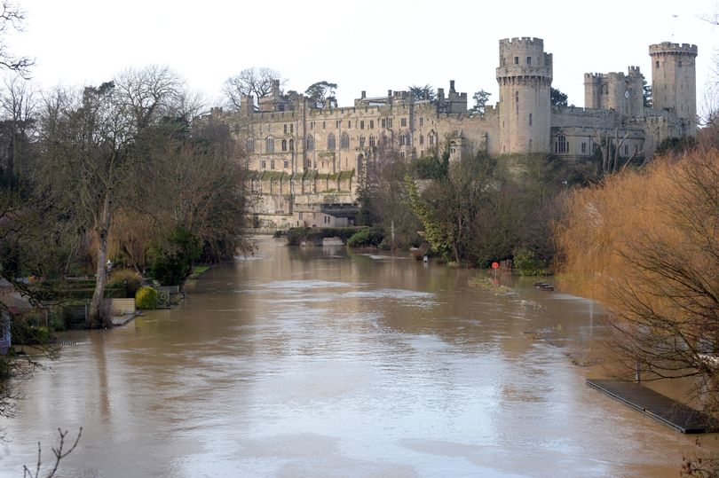

# The River Avon
## Stratford-upon-Avon
Stratford-upon-Avon was chosen as a town of interest, in regards to the investigation of flooding, due to the local knowledge of the author. A plaque erected on the banks of the River Avon in Stratford-upon-Avon, nearby to the Royal Shakespear Company's main building, displays the vast heights the river has reached in the past, thereby heavily implying a historical problem with flooding within the town.

*Plaque depicting historic flood heights in Stratford-upon-Avon - http://www.stratford-herald.com/83343-updated-river-avon-remains-on-flood-alert-as-water-levels-fall.html*

According to https://riverlevels.uk/river-avon-stratford-upon-avon-stratford, the most recent high recorded at the Stratford-upon-Avon gauging station was 1.89m on Monday the 26th of November 2012 and so it is this specific flood that will be investigated.

### Flooding Data

*Graph depicting the Avon's height during the months of November and December 2012, using data provided by the Environment Agency for the Cox's Yard guaging station located within Stratford-upon-Avon.*

The graph above clearly emphasizes two flooding events, one at the end of November (as expected from River Levels UK) but also another one at the end of December, most likely assisted by the ground already being waterlogged from the earlier November flood.

## Warwick
 

